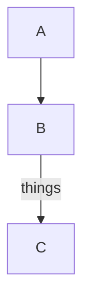
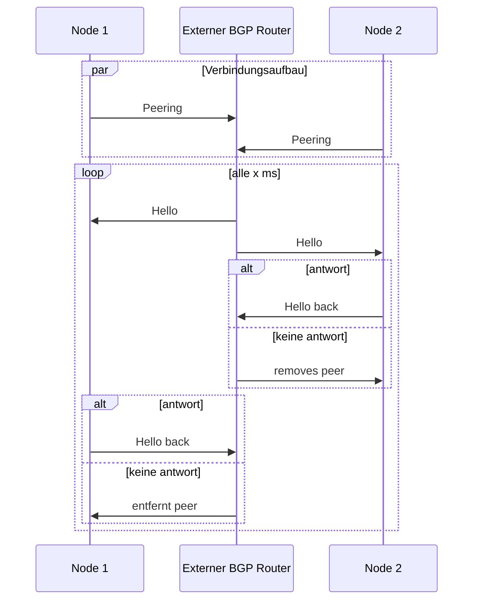

# Test file 

If it's in this file, it works for me :)

```go
var test string = "hi :)"
```


```mermaid
graph 
  A --> B 
  B -- things --> C
```


```mermaid
sequenceDiagram
    par Verbindungsaufbau
        Node 1->>Externer BGP Router: Peering
        Node 2->>Externer BGP Router: Peering
    end
    loop alle x ms
        Externer BGP Router->>Node 1: Hello
        Externer BGP Router->>Node 2: Hello
        alt antwort
            Node 2->>Externer BGP Router: Hello back
        else keine antwort
            Externer BGP Router->>Node 2: removes peer
        end
        alt antwort
            Node 1->>Externer BGP Router: Hello back
        else keine antwort
            Externer BGP Router->>Node 1: entfernt peer
        end
    end
```
